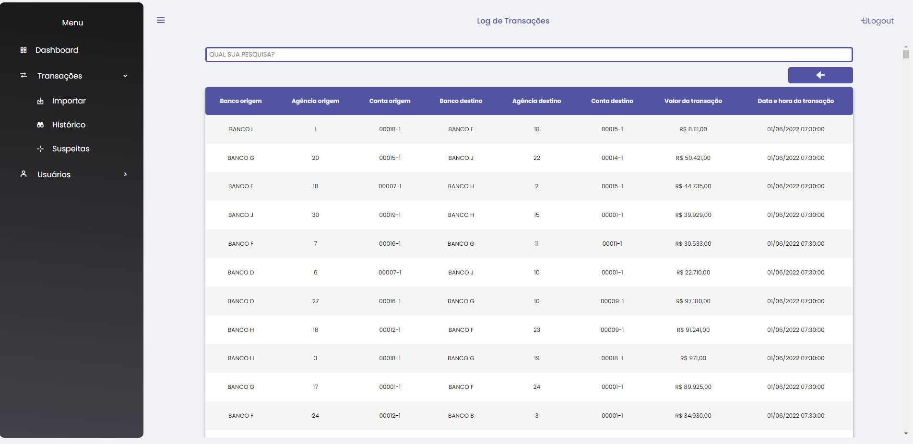

# Projeto de Registro e Avaliação de Transações Bancárias

Esta aplicação tem como principal objetivo analisar transações suspeitas e listar
as transações suspeitas. Este foi um projeto sugerido em um desafio da plataforma
de ensino ALURA, mas estou incrementado algumas funcionalidades não listadas
para este desafio, como exemplo a Tabela SQL de auditória de modificações
nos usuários e uma HomePage com Dashboards.

## Status do Projeto

- Em Desenvolvimento

## Tecnologia Usada

### Back-End

1. FLASK

### Front-End

1. JavaScript
2. CSS
3. HTML

### DataBase

1. Postgresql

### Infraestrutura

1. Docker
2. Heroku

## Como Ultilizar?

Podemos usar esta aplicação de 3 formas:

1. Acesso via página Web
2. Consumo da nossa API
3. Clonando o Repositório

### 1. Acesso via página Web:

#### Funcionalidades do site

1. Autenticação de Usuário
2. Importar Transações Bancárias
3. Relatório Geral de Transações
4. Histórico de Importações
5. Relatório de Suspeitas de Fraude
6. Cadastrar, Consultar, Alterar e Deletar usuário do sistema
7. Recuperar ou Trocar Senha de Acesso

Nosso app esta disponibilizado para uso atráves do link:
    
[transactions-analyzer.herokuapp.com](http://transactions-analyzer.herokuapp.com/)

##### 1. Autenticação de Usuário

Ao acessar o link, você irá se deparar com a nossa tela de login.

Para realizar o acesso criamos as credenciais de acesso para você testar:

    Nome do Usuário: ADMIN
    Senha: 123999

    obs: Nesta tela de login na região inferior a imagem econtramos um link para
    recuperação ou troca de senha. Esta funcionalidade será abordada
    no tópico 7 desta seção

##### 2. Home Page (Navegação + Relatório Geral de Transalções)

Após realizar o login, o usuário é redirecionado para nossa home page

Esta tela é composta por: dashboards, menu superior e uma barra de menu lateral

Dashboard:

    Os dados contidos na Dashboard são relativos as transações importadas no mês vigente,
    desta forma representando um relatório geral das trasações relativas ao mês corrente.

Menu Superior:

    Essa região contém, a esquerda, o icone para recolher ou mostrar o menu lateral,
    na região central fica o nome da tela, neste caso "Dashboard", a direita encontramos
    o botão para relizar o logout da aplicação.

Menu Lateral:

    Atrávez do menu de acesso lateral você pode navegar por nossa aplicação e acessar
    todas nossas funcionalidades. Ele é composto por essa opções:
    
    1. Dashboard
    2. Transações
        2.1 Importar
        2.2 Histórico
        2.3 Suspeitas
    3. Usuários
        3.1 Gerenciar

##### 3. Importar Transações

Para acessar a tela de importação você irá escolher a opção do menu lateral:

    Transações >  Importar

A tela de importação será carregada na home page

    Para escolher o arquivo desejado, clique na imagem com a seta apontada para cima.
    Ao escolher o arquivo a imagem irá mudar de uma seta para um V, o nome do arquivo
    irá aparece na tela e será habilitado um botão com nome "Enviar".
    Agora é só clicar em "Enviar"

##### 4. Histórico de Importações

Para acessar a tela de histórico de importações você irá escolher a opção do menu lateral:

    Transações >  Histórico

A tela de histórico será carregada na home page

Esta tela é composta por uma barra de pesquisa e logo abaixo uma tabela.

Barra de Pesquisa:

    Pra filtar os dados listados na tabela você pode digitar dentro deste campo a sua
    busca. A busca ocorre em todos os campos da tabela linha por linha.Caso não encontre
    o que você busca dentro de uma linha, ela será ocultada. 

Tabela:
    
    Esta tabela contém o log de transações realizadas. Cada arquivo importado através da
    opção Transações >  Importar é considerado um lote. Por exemplo: Um arquivo contendo
    transações do dia 01/06/2022 é considerado que essas transações fazem parte do lote
    01/06/2022. Dentro deste contexto esta tabela exibe o histórico de lotes importados.
    Caso deseje visualizar as transações contidas em um lote, você pode dar duplo click
    em uma das linha desta tabela. Ao realizar este procedimento uma nova tabela será
    exibida contendo as transações referente ao determinado lote da linha escolhida.

A nova tabela exibida será assim

    Esta nova tabela contém todas as transações contidas em um determinado lote. Podemos
    perceber que um botão com uma seta para esquerda foi habilitado logo acima da
    tabela. Este botão serve para retorna a tabela anterior, caso o usuário deseje
    verificar outro lote.

##### 5. Relatório de Suspeitas de Fraude

Para acessar a tela de suspeitas de fraude você irá escolher a opção do menu lateral:

    Transações >  Suspeitas

A tela de Suspeitas será carregada na home page

Esta tela é composta por um campo para a escolha do mês e ano no canto superior esquerdo,
no canto superior direito temos 3 campos para marcar (Transações, Contas, Bancos)
e 3 tabelas (Transações, Contas, Bancos) no centro da página.

Campo para Escolher Mês e Ano

    Através deste campo o usuário poderá escolher qual mês e ano que deseja realizar a
    avaliação de suspeitas. Após selecionar a data desejada ele deverá clicar no botão
    com a imagem de lupa, localizado no mesmo campo. Os dados referentes a data escolhida
    irão preencher as tabelas. 

    obs: As regras de suspeição ultilizadas foram:
    Transações >= 100000 (cem mil)
    Valor Total de Transações por Conta no mês >= 700000 (setessentos mil)
    Valor Total de Transações por Banco no mês >= 4900000 (quatro milhões e novecentos mil)

Campos para Marcar (Transações, Contas, Bancos)

    Estes campos servem para ocultar e mostrar as tabelas respecitvas aos seus nomes,
    como por exemplo: caso o usuário desmarque o campo com nome Transações a tabela
    com nome Transações irá sumir da tela, conforme imagem abaixo

##### 6. Cadastrar, Consultar, Alterar e Deletar Usuário do Sistema

Para acessar a tela de usuários você irá escolher a opção do menu lateral:

    Usuário >  Gerenciar

A tela de Gerenciar Usuário será carregada na home page

Esta tela é composta por um campo de busca na parte supeior, um botão para adicionar
usuário na parte superior a direta do campo de busca, uma tabela e um formulário
oculto. Ao entrar nesta tela ela exibirá todos os usuários cadastrados no sistema
na tabela.

Campo de Busca

    Pra filtar os dados listados na tabela você pode digitar dentro deste campo a sua
    busca. A busca ocorre em todos os campos da tabela linha por linha.Caso não encontre
    o que você busca dentro de uma linha, ela será ocultada.

Botão Adicionar Novo Usuário

    Este botão serve para a criação de um novo usuário. Ao ser clicado a tabela é
    ocultada e um formulário com os campos necessários para cadastrar o usuário é
    exibido. Conforme imagem abaixo
    
    

Formulário Oculto

Este formulário possui em seu topo um campo para o nome do usuário, logo abaixo temos
o campo para o email, em baixo deste campo o campo status, um botão de salvar e um
botão de voltar

    Caso o usuário clique no botão para criar um novo usuário este formulário
    é exibido sem nenhum dos campos preenchidos, porém caso seja para alterar o usuário
    este formulário será carregado com as informações do usuário selecionado. Após
    preencher os campos ou edita-los, o usuário deverá clicar em salvar, mas caso
    deseje retorna a tabela de consulta de usuário ele poderá clicar em volta,
    fazendo isso as informações preenchidas não serão salvas no banco de dados

    obs 1: Ao cadastrar um novo usuário, o sistema enviará uma senha para o email
    informado. Caso o usuário deseje realizar a troca desta senha, ele poderá,
    através da página de login, clicar no link "Recuperar ou Trocar senha" e
    realizar a troca.

    obs 2: Todas as alterações realizadas são registradas em uma
    tabela de auditoria através de uma Trigger registada no banco SQL. Desta
    forma podemos auditar quaisquer mudanças realizas e identifcar o usuário
    responsável

Tabela

    Esta tabela contém as informações básicas do usuário. Caso deseje alterar um deste
    registro, você deverá realizar um duplo clique na linha deseja. Desta forma
    a tabela irá ser ocultada e o formulário de usuário será exibido com as
    informações referentes a linha escolhida.

##### 7. Recuperar ou Trocar Senha de Acesso

Esta tela se divide em 3 etapas:

    1. Informar o nome do usuário que se deseja recuperar/trocar a senha
    2. Informar o código/token enviado para email de cadastro do usuário
    3. Informar o novo password
    
###### Etapa 1: Informar o nome do usuário que se deseja recuperar/trocar a senha

Para acessar a tela de recuperação de senha você irá acessar a tela de login e clilar no
link "Recuperar ou Trocar senha", localizado logo abaixo da imagem. Quando clicar no
link você será redirecionado para a tela de Recuperação de Senha abaixo:

    Ao entrar nesta tela o requisitante deve informar o nome do usuário que
    deseja realizar a troca de senha e clicar em "Próximo". Feito isso será enviado
    um email contendo um código/token para o email vinculado ao usuário
    informado e a etapa 2 será carregada.

###### Etapa 2: Informar o código/token enviado para email de cadastro do usuário

    Nesta tela o usuário deverá informar o código/token que foi enviado para seu
    email e clicar em "Próximo". Feito isso será carregada a etapa 3

###### Etapa 3: Informar o novo password

    Agora o usuário deverá informar sua nova senha e confirma-la. A Senha deve
    conter no mínimo 8 caracteres, dentre eles um caractere especial, uma letra
    maiúscula e um número. Feito isso clique em "Próximo" para finalizar. Caso
    ocorra tudo como esperado a tela abaixo deverá ser carregada.

    Obs 1: Caso o token seja informado incorreto, você deverá repetir o processo,
    pois este token é válido apenas para uma tentativa.

    Obs 2: Cada usuário só pode realizar 3 tentativas a cada 5 minutos.

    Estando neste tela é só clicar em finalizar.

### 2. Consumir nossa API:
    
    A documentação de consumo da nossa API esta disponível através do
    Swagger UI. Você pode acessar através das opções abaixo

#### Link Servidor de Produção

    Caso não deseje não rodar a aplicação localmente em seu computador, você
    pode usar o link abaixo para realizar as requisições das rotas da API.

[1. Swagger Prod - Transactions Analyzer API](http://transactions-analyzer.herokuapp.com/apidocs/)

#### Link Servidor Local

    Caso esteja rodando a aplicação localmente em seu computador, você pode
    opatar por essa alternativa.

[2. Swagger Local - Transactions Analyzer API](http://127.0.0.1:5001/apidocs/)

### 3. Clonando Repositório:

Os requisisto para rodar o projeto localmente são:

    1. PostgreSQL
    2. Git
    3. Poetry
    4. GNU Make
    5. Email GMAIL habilitado para  envio por APPS
    

Para clonar o respósitório você deve criar uma pasta com nome que desejar
e usar o comando abaixo para baixar nosso projeto para dentro dela

    git clone https://github.com/lspraciano/transactions_analyzer.git

Feito isso devemos criar um arquivo com nome .env que irá conter as varáveis
de ambiente necessária para rodar o projeto. Este arquivo .env deverá ser
inserido na raiz do projeto, no mesmo nível do arquivo run.py, por exemplo.
O conteúdo dele foi listado abaixo:

    SECRET_KEY='uma chave secreta'

    DEV_SQLALCHEMY_DATABASE_URI='URI para o banco de desenvolvimento'
    TEST_SQLALCHEMY_DATABASE_URI='URI para o banco de test'
    PROD_SQLALCHEMY_DATABASE_URI='URI para o banco de produção'

    ADMIN_PASSWORD='senha do usuário administrador do sistema'
    ADMIN_EMAIL='email do usuário administrador do sistema'
    
    MAIL_USERNAME='email pelo qual o sistema enviará os email'
    MAIL_PASSWORD='token/senha do email para o envios do sistema'

Após realizar esta configuração, vamos instalar as dependências através do
comando abaixo:
    
    make install

Agora estamos prontos para rodar nosso projeto usando o comando:

    make run

Você poderá roda-lo no modo de desenvolvimento, produção ou teste. O que
irá determinar qual modo ele será iniciado é a variávle de ambiente
FLASK_ENV. Ela pode ser configurada em 3 valores:

    1. development
    2. prodcution
    3. test

1. development

    - Setando para development a aplicação irá rOdar eM modo de desnvolvimento

2. production

    - Setando para production a aplicação irá rodar em modo de produção

3. test

   - Setando para test a aplicação irá rodar em modo de test

Através do comando

    make test

Você pode realizar os testes automatizados da aplicação.